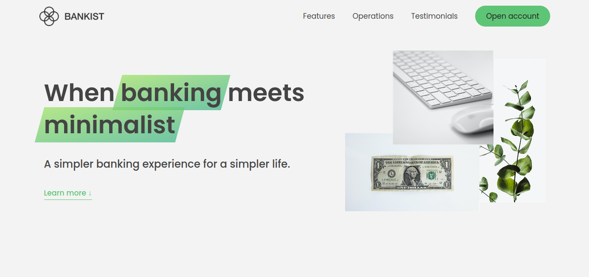

# BankistSite

🏦 BankistSite is a banking website designed to streamline banking processes and enhance user experience. It incorporates advanced JavaScript DOM techniques and was developed as part of Jonas Schmedtmann's JavaScript course.

## Overview
BankistSite aims to simplify banking tasks and provide users with a seamless online banking experience. Leveraging advanced JavaScript DOM concepts, the website offers intuitive features and interactive elements.

## Demo

Check out the live demo [here](https://bankistsite-demo.netlify.app/).

## Course Information
This project is part of the [Complete JavaScript Course](https://www.udemy.com/course/the-complete-javascript-course/?couponCode=ST12MT030524) by Jonas Schmedtmann.

## About the Developer
**Name:** Islam Sobhy Eladly
**LinkedIn:** [Islam Sobhy Eladly](https://www.linkedin.com/in/islam-sobhy-eladly/)

## Features
- Advanced JavaScript DOM techniques
- Intuitive user interface
- Seamless banking experience
- Interactive elements for enhanced user engagement

## Getting Started
To get started with BankistSite, simply clone the repository and open the `index.html` file in your preferred web browser.

## Acknowledgements
This project was developed under the guidance of Jonas Schmedtmann's comprehensive JavaScript course, "The Complete JavaScript Course" available on Udemy.

🚀 Happy banking with BankistSite! 🌟
